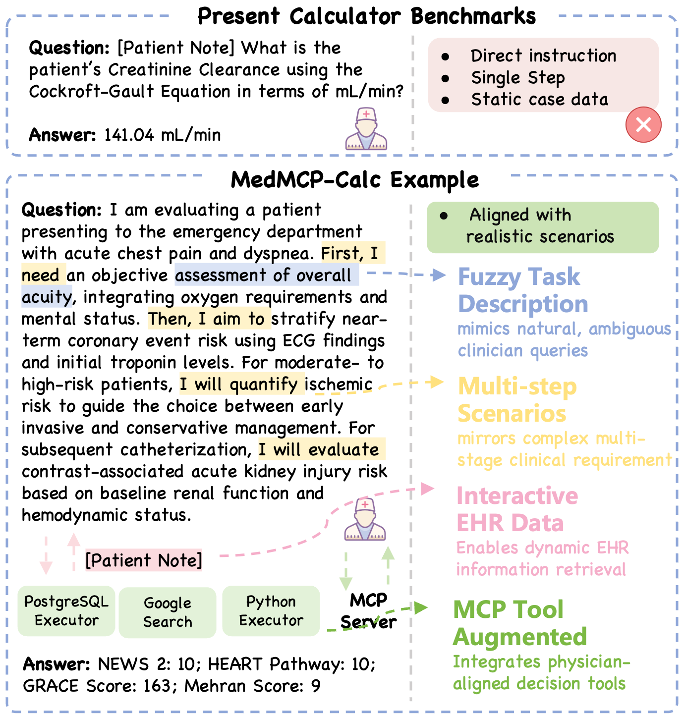

# MedMCP-Calc: Benchmarking LLMs for Realistic Medical Calculator Scenarios via MCP Integration

<p align="center">
  <a href="https://github.com/SPIRAL-MED/MedMCP-Calc">
    
  </a>
  <a href="https://github.com/SPIRAL-MED/MedMCP-Calc/blob/main/LICENSE">
    
  </a>
  <a href="https://github.com/SPIRAL-MED/MedMCP-Calc">
    
  </a>
</p>

<p align="center">

</p>

<p align="center">
  <strong>The first benchmark for evaluating LLMs in realistic medical calculator scenarios through MCP integration.</strong>
</p>


## Contents

- [Introduction](#introduction)
- [Getting Started](#getting-started)
  - [Database Setup](#1-database-setup)
  - [Configuration & Verification](#2-configuration--verification)
  - [Benchmark Evaluation](#3-benchmark-evaluation)
- [Contact Us](#contact-us)
- [Citation](#citation)

## Introduction

Medical calculators are fundamental tools in clinical practice, enabling clinicians to transform patient data into actionable decisions through evidence-based formulas. However, existing benchmarks evaluate models under **simplified conditions** that deviate substantially from real-world practice: they provide all necessary inputs upfront and specify which calculator to use, reducing the task to straightforward arithmetic.

The emergence of the **Model Context Protocol (MCP)**—often described as the "USB-C of AI"—offers a promising pathway for LLM agents to seamlessly interface with external tools. This raises a natural question: *Can we leverage MCP to build a realistic workbench that mirrors actual clinical calculator workflows?*

We present **MedMCP-Calc**, the first benchmark designed to evaluate LLMs on realistic medical calculator tasks integrated with MCP servers. MedMCP-Calc requires agents to perform two critical capabilities that existing studies overlook: (1) **scenario-based planning**—analyzing clinical contexts and orchestrating multiple calculators through multi-step reasoning, and (2) **proactive data acquisition**—dynamically querying structured EHR databases rather than extracting information from pre-provided text. Our benchmark comprises **118 clinically grounded scenarios** spanning four medical domains, supported by three MCP servers: PostgreSQL for iterative evidence acquisition, Google Search for retrieving up-to-date references, and Python for self-coded calculations.

<p align="center">

</p>

We conduct extensive experiments across state-of-the-art LLMs and find that *even the strongest models struggle with these realistic workflows*—notably, most models exhibit a **low propensity to invoke available tools**. We develop **CalcMate** through scenario planning training and proactive tool augmentation, achieving substantial improvements over existing approaches. This demonstrates that *encouraging active tool use yields significant gains in agentic medical tasks*.

We hope MedMCP-Calc will serve as a rigorous and clinically meaningful testbed for advancing LLMs toward genuine clinical utility.

## Getting Started

### 1. Database Setup

The MedMCP-Calc benchmark requires a PostgreSQL database to simulate real-world EHR data interactions. The database is populated with EHR data derived from MIMIC-IV and partially synthetic data, comprising a total of 49,537 patients.

**Prerequisites**

- Git LFS installed (for large data files)
- PostgreSQL 12.0 or higher installed and running
- At least **20GB** of available disk space for the database
- Approximately **1.5GB** for the repository

For PostgreSQL installation instructions, visit: http://www.postgresql.org/download/

You can verify that PostgreSQL is running successfully with:

```bash
pg_isready
```

**Installation Steps**

Clone the Repository:

```bash
# Install Git LFS if not already installed                                                                                                                               
git lfs install

git clone https://github.com/SPIRAL-MED/MedMCP-Calc.git
cd MedMCP-Calc
```

Navigate to Database Directory:

```bash
cd benchmark/database
```

Run the Build Script:

The `build.sh` script will automatically create the database schema and load all synthetic patient data.

```bash
./build.sh
```

The build process may take several minutes depending on your system specifications.

After successful execution, you will have:

- **Database**: `medmcpcalc_database` containing 49,419 synthetic patient records
- **Read-only User**: `medmcpcalc_readonly_user` for secure query access
- **Default Password**: `PASSWORD` (change this in production environments)

### 2. Configuration & Verification

MedMCP-Calc uses the Model Context Protocol (MCP) to integrate three core tool servers: Google Search, PostgreSQL Executor, and Python Executor. You need to configure the server settings before running the benchmark.

**Configuration File**

Navigate to the MCP configuration file:

```bash
cd codes
nano medmcpcalc_mcp/servers_config.json
```

Modifying Environment Variables:

The configuration file contains three server definitions. You only need to modify the `env` section for each server. Here's an example with the Google Search server:

```json
"google_search": {
  "command": "python",
  "args": ["-m", "medmcpcalc_mcp.servers.google_search", "--transport", "stdio"],
  "env": {
    "GOOGLE_API_URL": "https://google.serper.dev/search",
    "GOOGLE_API_KEY": "YOUR_API_KEY_HERE"
  }
}
```

Key Configuration Points:

- **Google Search**: Replace `YOUR_API_KEY_HERE` with your Serper API key (you can also use alternative search APIs by modifying both URL and key)
- **PostgreSQL Executor**: Update `DB_DSN` if you modified database credentials in `build.sh` (otherwise, use the default)
- **Python Executor**: No configuration needed

**Verification**

Before running the full benchmark, verify your configuration:

Test LLM API Connection

```bash
cd codes
./inference.sh --llm_api_test \
    --model_name YOUR_MODEL \
    --base_url YOUR_API_ENDPOINT \
    --api_key YOUR_API_KEY
```

Expected output: A valid response from the LLM.

Test MCP Servers

```bash
./inference.sh --mcp_test
```

Expected output shows successful tool execution for all three servers:

```
--------------------------------------------------
🔎 Testing Server: google_search
   Executing tool 'search' (query='Dog')...
   ✅ Execution successful! Result preview: ...
   Executing tool 'fetch' (url='https://www.mdcalc.com/calc/3836/...')...
   ✅ Execution successful! Result preview: ...

--------------------------------------------------
🐍 Testing Server: python_executor
   Executing tool 'run_python'...
   ✅ Execution result: ...

--------------------------------------------------
🗄️  Testing Server: postgres_executor
   Executing tool 'run_read_only_sql' ...
   ✅ Execution result: ...
   Executing tool 'list_tables' ...
   ✅ Execution result: ...
```

> Note: If you need to use a proxy for network access, add `ENABLE_PROXY=true` before the commands above.

### 3. Benchmark Evaluation

After setting up the database and MCP servers, you can evaluate LLM performance on medical calculator tasks through inference and simulation.

**Run Inference**

Execute the benchmark with your model:

```bash
cd codes
./inference.sh --model_name YOUR_MODEL \
    --base_url YOUR_API_ENDPOINT \
    --api_key YOUR_API_KEY
```

The script uses a concurrency level of 2 (`max_workers=2`) to ensure stable database access. Inference typically completes within 5 hours for API-based models and 1-2 hours for local models.

Results are saved to the `outputs/` directory.

**Compute Metrics**

Evaluate the inference results using an LLM for answer extraction and comparison:

```bash
python evaluation.py \
    --evaled_model YOUR_MODEL \
    --model_name EXTRACTION_MODEL \
    --base_url API_ENDPOINT \
    --api_key API_KEY
```

We recommend using DeepSeek V3.1 as the extraction model based on our experiments.

**View Statistics**

After evaluation completes, generate summary statistics:

```bash
python evaluation.py \
    --evaled_model YOUR_MODEL \
    --stats_only
```

This outputs overall metrics and per-scenario breakdowns consistent with the paper.


## Contact Us

If you are interested in our project and would like to join us, feel free to send an email to [xiaofan.zhang@sjtu.edu.cn](mailto:xiaofan.zhang@sjtu.edu.cn).

<!-- ## Citation

If you find this work useful, please cite our paper.

```
@article{zhu2025medmcp,
  title={MedMCP-Calc: Benchmarking LLMs for Realistic Medical Calculator Scenarios via MCP Integration},
  author={},
  journal={Coming Soon},
  year={2026}
}
``` -->
